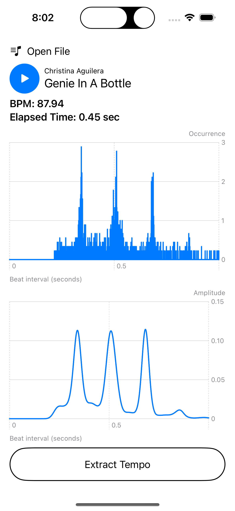

# BPMDetector
Implementation of a tempo detection algorithm in Swift.

  

The algorithm was originally proposed by Tsang Kei Man in his 2006 paper titled _Tempo Extraction using the Discrete Wavelet Transform_.

### The Algorithm
1. A discrete wavelet transform is applied to the audio data for four iterations to obtain the DWT coefficients, cD1 to cD4.
2. Peak detection is performed for cD1 to cD4 concurrently. After getting the peaks of these coefficients, the beat intervals are calculated from these peaks.
3. Four sets of beat interval information are combined to create a histogram.
4. The histogram is smoothed with a Gaussian function to improve accuracy. 
5. After these stages, the tempo of the audio data can be obtained.

### TODO:
- [ ] Improve peak detection using the derivative method
- [ ] Identify the beat locations
